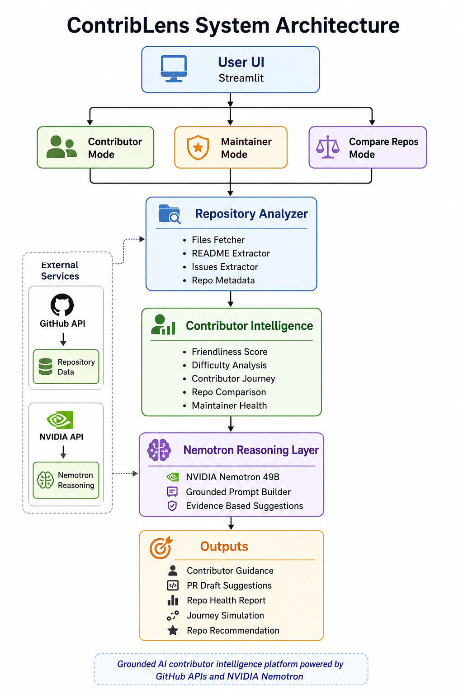

# ContribLens

Turn intimidating repositories into contributor friendly journeys.

ContribLens helps developers understand open source repositories faster by analyzing repository structure, contributor friendliness, onboarding readiness, and contribution opportunities.

Built for the Nemotron 3 Super Meetup Contest hosted by HydPy.

---

## Problem

Open source contribution can feel overwhelming.

Large repositories contain many folders, files, workflows, and contribution expectations that are difficult for beginners to understand.

New contributors often struggle with:

- Understanding repository structure
- Finding where to start
- Identifying beginner friendly contribution opportunities
- Estimating contribution difficulty
- Understanding project onboarding quality

ContribLens aims to reduce contributor friction and improve onboarding experience.

---

## Solution

ContribLens analyzes GitHub repositories and generates contributor focused insights.

The application evaluates:

- Repository structure
- Contributor friendliness score
- Documentation availability
- Contribution readiness
- Open contribution opportunities
- Beginner onboarding guidance

The goal is helping contributors move from:

Repository confusion

↓

Repository understanding

↓

Meaningful contribution

---

## Features

### Repository Structure Analysis

Displays repository folders and important files.

### Contributor Friendliness Score

Calculates onboarding readiness using signals like:

- README presence
- Contribution guide availability
- Documentation availability
- Open issue availability
- GitHub workflow configuration

### Contributor Mentor

Provides beginner guidance including:

- Suggested learning path
- Repository complexity estimation
- Documentation recommendations
- Contribution preparation guidance

### Contribution Opportunity Analysis

Analyzes repository issues and estimates contribution difficulty.

---

## Architecture



---

## Tech Stack

Python

Streamlit

PyGithub

GitHub API

python-dotenv

---

## Project Structure

```

ContribLens/

├── app.py

├── README.md

├── requirements.txt

├── architecture.png

├── .env.example

├── docs/

│ ├── screenshots/

│ └── design_decisions.md

└── sample_repos.md

```

---

## Installation

Clone repository

```bash
git clone https://github.com/nimeghala45/ContribLens.git
```

Move into project

```bash
cd ContribLens
```

Install dependencies

```bash
pip install -r requirements.txt
```

Create .env

```env
GITHUB_TOKEN=your_token
```

Run application

```bash
streamlit run app.py
```

---

## Example Tested Repositories

HydPy meetup repository

FastAPI

Requests

Open source repositories of varying complexity

---

## Screenshots

Add screenshots inside:

docs/screenshots/

Example:

HydPy analysis

Repository onboarding recommendations

Contribution opportunity insights

---

## Future Improvements

Nemotron reasoning integration

Contributor skill matching

AI generated onboarding roadmaps

Repository contribution simulation

---

## Safety

Recommendations are guidance only.

Contributors should validate repository documentation before making changes.

---

## Contest Alignment

Community Value

Grounded repository insights

Actionable contributor guidance

Operational efficiency

Accessibility focused contributor experience

---

## Author

Nishna

Built for HydPy Nemotron Contest 2026